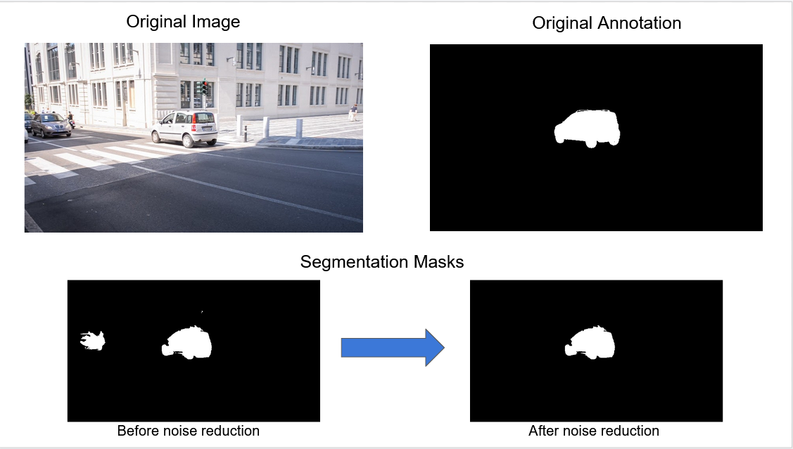

# CS-585 Project : Object Tracking
Implementing object tracking system using the OSVOS fully-convolutional neural network.

Project by: Angelo Facciponti Menella, Ansh Gupta, Navoneel Ghosh, Sherry Courington

## What is OSVOS?
OSVOS is a method that tackles the task of semi-supervised video object segmentation. It is based on a fully-convolutional neural network architecture that is able to successively transfer generic semantic information, learned on ImageNet, to the task of foreground segmentation, and finally to learning the appearance of a single annotated object of the test sequence (hence one-shot). Experiments on DAVIS 2016 show that OSVOS is faster than currently available techniques and improves the state of the art by a significant margin (79.8% vs 68.0%).

- Full details of OSVOS can be found in the **README** inside the OSVOS-Tensorflow directory.

## Installation and dependencies:
- All the dependencies are listed in the requirement.txt. The original OSVOS code was written using Tensorflow v1. 
Therefore, our implementation requires specific version of Python and Tensorflow. We have tested our code with Python 3.6 and Tensorflow v1.15.0. However, any Python<3.6 and Tensorflow v1.x should work.  
Download pre-trained models from [here](https://drive.google.com/file/d/1KWlQAV8Ss17gXamHzPi-qmF5QVE8bJ-u/view?usp=sharing)             
**Extract the pre-trained models to the models directory. It should create a folder for each dataset with its respective model in it.**
**Please look at the project specific instructions below to test recycling data.**    

## Implementation:
1. We either train the network using one of the video frames and its annotated segmentation mask or we use the pre-trained model.
2. We test the model with the dataset. This produces segmentation masks for all the frames.
3. We then determined the contour area and chose the maximum contour area to reduce noise in the segmentation mask.
4. After reducing the noise, we implement a Kalman tracker and assign a tracking ID to the object, by finding the centroid using moments.


5. Lastly, we calculated the IoU score of both segmentation masks with noise and w/o noise with respect to the provided annotations. In both our test cases, we were able to increase the IoU score.    


## User variable manipulation:
The user can set different variables accoring to their requirements in the ```osvos_run_tracker.py``` file.   
```seq_name = "car-shadow"```         - Change to train and test other data sets. Should be the name of the folder containing the images.   
```gpu_id = 0```                      - Change according to your GPU id.   
```train_model = False```             - Change to train/not train the model. If set to False, you need pre-trained model.   
```max_training_iters = 2000```       - Change this according to the model name if using the pretrained models.   
```train_img_name = '00000.jpg'```    - Change to train with a different frame.   
```annot_img_name = '00000.png'```    - This should be the same as the 'train_img_name'. Extensions of file should used accordingly.   
```show_per_frame_iou = False```       - Set this to True to show IoU score of every frame, False to show just mean IoU score.   

## Instructions to test of recycling data
- Due to lack of annotation data in the recycling data, we were unable to calculate the IoU score.    
- We tried to track the green soda bottle in the dataset.    
- It succeeded for the most part except the beginning of frames where it tried to track another similarly shaped object as the soda bottle was not yet in frame.     
        
To test with recycling data, set the following - 
```
seq_name = "recycling"         # Change to train and test other data sets. Should be the name of the folder containing the images.      
gpu_id = 0                      # Change according to your GPU id.               
train_model = False             # Change to train/not train the model. If set to False, you need pre-trained model.            
max_training_iters = 500       # Change this according to the model name if using the pretrained models              
train_img_name = '00075.png'    # Change to train with a different frame               
annot_img_name = '00075.png'    # This should be the same as the 'train_img_name'. Extensions of file should used accordingly.             
show_per_frame_iou = False 
```


## Discussion:
While implementing the tracking, we noticed that the output from the OSVOS model is actually more accurate with respect to the original image. It was actually able to detect the other cars in the frames. This is likely because OSVOS is based on network like VGG16 which was trained on the ImageNet and therefore was able to detect the other cars.   
We considered this scenario as noise because the provided annotation suggests that the tracker should detect only one car. And therefore, removed the other car from the segmentation mask.

## Future Enhancements:
For future enhancements, we would try to implement multi-object tracking.

## Citation:
	@Inproceedings{Cae+17,
	  Title          = {One-Shot Video Object Segmentation},
	  Author         = {S. Caelles and K.K. Maninis and J. Pont-Tuset and L. Leal-Taix\'e and D. Cremers and L. {Van Gool}},
	  Booktitle      = {Computer Vision and Pattern Recognition (CVPR)},
	  Year           = {2017}
	}